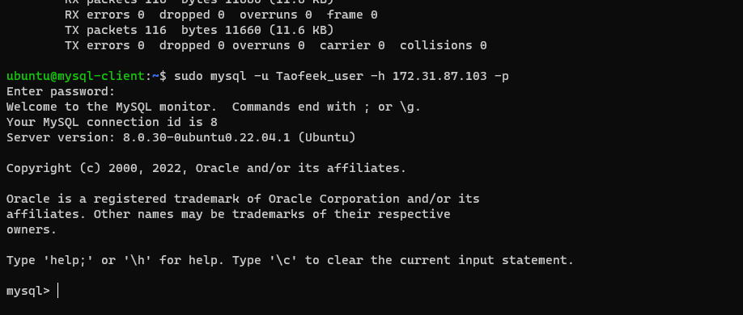
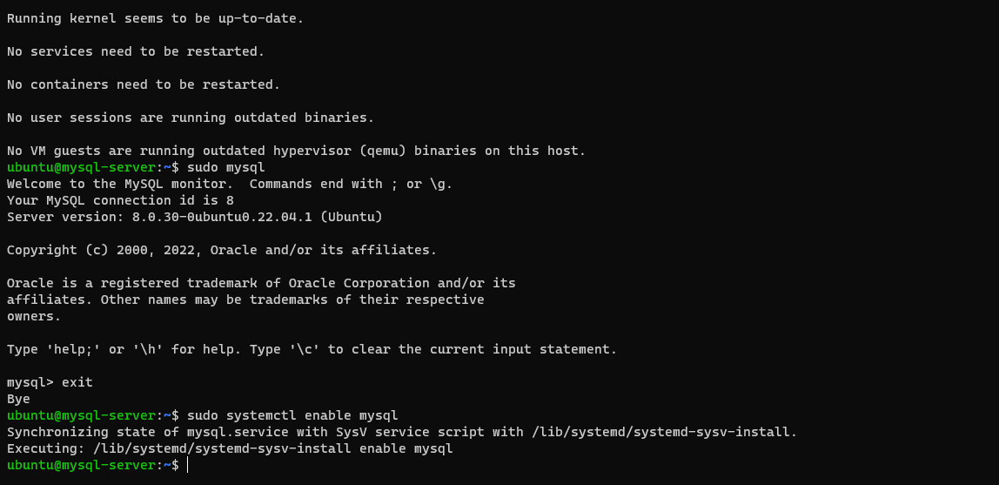
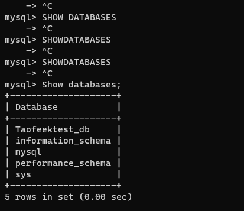

IMPLEMENT A CLIENT SERVER ARCHITECTURE USING MYSQL DATABASE MANAGEMENT SYSTEM (DBMS)
`sudo apt update`

`sudo apt upgrade`

`sudo apt install mysql-client`

`sudo apt install mysql-server`

`sudo systemctl enable mysql`

`sudo mysql_secure_installation`

`sudo mysql`

`CREATE DATABASE Taofeektest_db;`

`mysql>  CREATE USER 'Taofeek_user'@'%' IDENTIFIED WITH mysql_native_password BY 'password';`

`mysql> GRANT ALL ON Taofeektest_db.* TO 'Taofeek_user'@'%';`

`sudo vi /etc/mysql/mysql.conf.d/mysqld.cnf`

`sudo systemctl restart mysql`

`sudo mysql -u Taofeek_user -h 172.31.87.103 -p`

